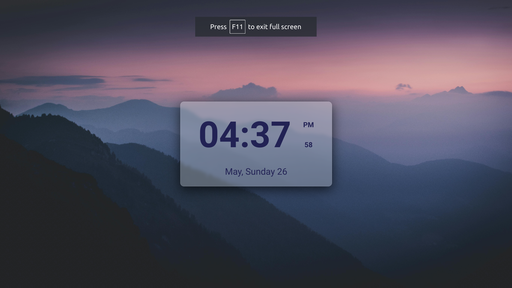

# Digital Clock Project

## Project Description
This project is a digital clock created using HTML, CSS, and JavaScript. The clock displays the current time, day of the week, month, and date, with a sleek and modern design. The background of the webpage features a video for enhanced visual appeal. The clock is responsive and adjusts to different screen sizes, ensuring a consistent user experience across devices.

## Features
- Displays current time in 12-hour format with AM/PM indicator.
- Shows the current day of the week, month, and date.
- Background video that loops continuously.
- Responsive design for various screen sizes.
- Stylish and modern UI with a translucent clock background.

## Technologies Used
- **HTML**: Structure of the webpage.
- **CSS**: Styling of the clock and background video.
- **JavaScript**: Functionality to update the time and date dynamically.

## Team Members
- **115** - Sunny Kumar
- **116** - Suraj Kr Singh
- **118** - Sushant Raj
- **119** - Swarnendu Roy
- **120** - Trisha Nandi
- **121** - Ujjwal Raj
- **122** - Umesh Kumar
- **123** - Vaibhav Anand
- **124** - Vishal Kumar

## Usage
1. Clone the repository to your local machine.
2. Open `index.html` in a web browser to view the digital clock.
3. The clock will automatically update the time, day, month, and date.

## File Structure
- `index.html`: The main HTML file containing the structure of the webpage.
- `styles.css`: The CSS file for styling the clock and background.
- `script.js`: The JavaScript file for updating the time and date.
- `img/p2.jpg`: The video file used for the background.

## Preview

Enjoy your stylish digital clock!
